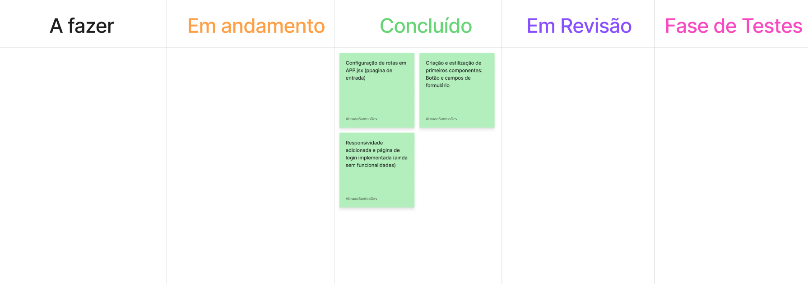

# Blabry — Frontend

Interface web do Blabry, uma plataforma de comunicação em tempo real com chat privado, feed de publicações e perfis de usuário. Desenvolvida em React com Vite como projeto de portfólio para demonstrar domínio de fundamentos de desenvolvimento web, componentização e integração com APIs REST e WebSockets.

---

## Tecnologias

- React 19
- Vite 8
- React Router DOM
- CSS puro com variáveis customizadas

---

## Como rodar localmente

```bash
# Clone o repositório
git clone https://github.com/abraaosantosdeveloper/blabry-front-end.git

# Entre na pasta do app
cd blabry-front-end/app

# Instale as dependências
npm install

# Inicie o servidor de desenvolvimento
npm run dev
```

Acesse `http://localhost:5173` no browser.

---

## Estrutura de pastas

```
app/
├── public/
├── src/
│   ├── assets/
│   │   └── icons/
│   ├── components/
│   │   ├── buttons/
│   │   └── inputs/
│   ├── pages/
│   ├── services/
│   ├── hooks/
│   └── styles/
│       └── variables.css
docs/
├── assets/
│   └── board/
└── docs/
```

---

## Protótipo

O protótipo completo das telas foi desenvolvido no Figma antes da implementação, cobrindo todas as decisões de layout, identidade visual e fluxos de navegação.

[Acessar protótipo no Figma](https://www.figma.com/design/7vcFhk7gK74MfC3JtRUEd1/Blabry-%E2%80%94-prototype?node-id=0-1&t=UEJD1tjCayNNK8Pf-1)

---

## Gestão do projeto

O desenvolvimento é guiado por épicos e histórias de usuário documentados em FigJam, seguindo os princípios do livro Engenharia de Software Moderna. O quadro Kanban registra o progresso de cada tarefa.



---

## Modelo 3C

O modelo 3C (Cartão, Conversa e Confirmação) foi utilizado para documentar as histórias de usuário. Cada história passou por uma conversa entre o desenvolvedor (P.O) e o cliente antes de ser implementada, garantindo que os critérios de aceitação estivessem claros antes do início do desenvolvimento.

As histórias de usuário do Blabry foram documentadas seguindo o modelo 3C — Cartão, Conversa e Confirmação. As conversas entre P.O e desenvolvedor estão registradas com visualização interativa na documentação oficial.

[Acessar Modelo 3c](https://abraaosantosdeveloper.github.io/blabry/docs/modelo-3c)

---

## Requisitos não funcionais

### Performance

| ID | Descrição |
|---|---|
| RNF-F01 | A aplicação deve carregar a tela inicial em menos de 3 segundos em conexões padrão. |
| RNF-F02 | Transições entre seções da SPA devem ser executadas em menos de 300ms. |
| RNF-F03 | Imagens e SVGs devem ser otimizados antes do build. |
| RNF-F04 | O bundle gerado pelo Vite deve ser minificado e dividido por rota (code splitting). |

### Usabilidade

| ID | Descrição |
|---|---|
| RNF-F05 | A interface deve ser responsiva para telas a partir de 320px de largura. |
| RNF-F06 | Todos os campos de formulário devem ter label visível e placeholder descritivo. |
| RNF-F07 | Ações destrutivas devem exigir confirmação explícita do usuário antes de serem executadas. |
| RNF-F08 | O usuário deve receber feedback visual para todas as ações — loading, sucesso e erro. |

### Acessibilidade

| ID | Descrição |
|---|---|
| RNF-F09 | Todos os elementos interativos devem ser acessíveis via teclado. |
| RNF-F10 | Imagens devem ter atributo `alt` descritivo. |
| RNF-F11 | O contraste entre texto e fundo deve seguir o mínimo recomendado pelo WCAG 2.1 nível AA. |

### Segurança

| ID | Descrição |
|---|---|
| RNF-F12 | O token JWT deve ser armazenado em `sessionStorage` — não em `localStorage` — para limitar a exposição a ataques XSS. |
| RNF-F13 | Nenhuma informação sensível deve ser exibida em mensagens de erro visíveis ao usuário. |
| RNF-F14 | Rotas protegidas devem redirecionar para o login caso o token esteja ausente ou expirado. |

### Manutenibilidade

| ID | Descrição |
|---|---|
| RNF-F15 | Componentes reutilizáveis devem ser isolados na pasta `components/` com responsabilidade única. |
| RNF-F16 | Chamadas à API devem estar centralizadas na pasta `services/` — nunca dentro de componentes ou páginas. |
| RNF-F17 | Variáveis de cor e tipografia devem ser definidas exclusivamente no `variables.css` via custom properties. |

---

## Devlog

### v0.1.0
*2026*

Estrutura base do projeto React iniciada com Vite. Roteamento configurado com React Router DOM cobrindo as cinco rotas principais da aplicação. Componentes base de autenticação criados — `AuthInput` com campos controlados via `useState` e `AuthButton` com prop `onClick`. Tela de Login implementada com navegação para cadastro e responsividade mobile.

---

## Documentação completa

A documentação técnica detalhada — decisões de design, arquitetura de componentes e guias de contribuição — está disponível em:

[Acessar documentação](https://abraaosantosdeveloper.github.io/blabry-docs/)

---

## Backend

O servidor da aplicação, responsável pela API REST, WebSockets e banco de dados, está em repositório separado:

[blabry-back-end](https://github.com/abraaosantosdeveloper/blabry-api)